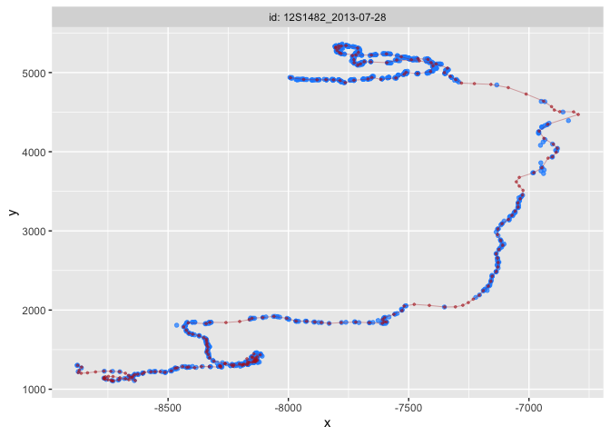
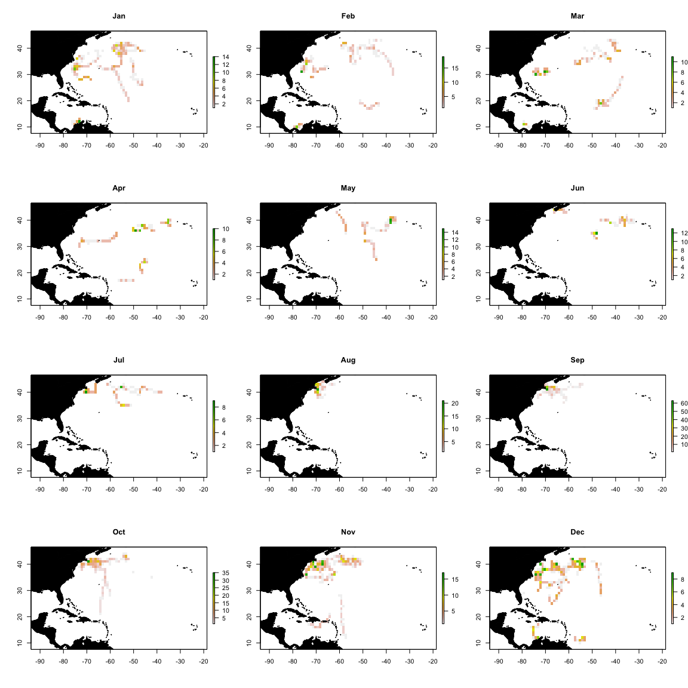
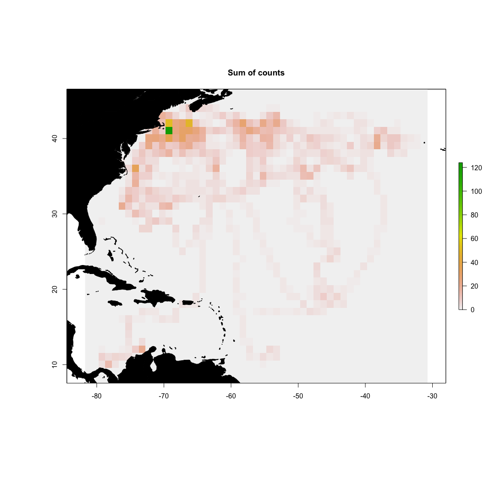

Blue shark standardization example
================

``` r
library(sp)
library(tidyverse)
library(raster)
library(lubridate)
library(fields)
library(foieGras)
```

This example demonstrates the standardization process using an example
set of blue shark satellite tag data. The data used here are associated
with Braun CD, Gaube P, Sinclair-Taylor TH, Skomal GB, Thorrold SR
(2019) Mesoscale eddies release pelagic sharks from thermal constraints
to foraging in the ocean twilight zone. Proc Natl Acad Sci U S A
116:17187–17192 (doi:
[10.1073/pnas.1903067116](https://doi.org/10.1073/pnas.1903067116)), and
the data are archived at DataOne (doi:
[10.24431/rw1k329](https://doi.org/10.24431/rw1k329)).

## Raw to Level 1

Preparing data for Level 1. Conversion from format output by Wildlife
Computers Portal to standardized set of Level 1 position data.

``` r
## list of raw Wildlife Computers tag data files
fList <- list.files('./wildlife_computers_raw/', full.names = TRUE, recursive = TRUE)
loc_files <- fList[grep('Locations', fList)]

## this metadata is modified from the original metadata at the DataOne repo to match the proposed standardization templates
meta <- read.table('braun_blues_deployment-metadata.csv', sep = ',', header = TRUE, stringsAsFactors = FALSE)
meta$trackStartTime <- lubridate::parse_date_time(meta$trackStartTime, orders = 'YmdHMS', tz = 'UTC')
meta$trackEndTime <- lubridate::parse_date_time(meta$trackEndTime, orders = 'YmdHMS', tz = 'UTC')

for (i in 1:length(loc_files)){
  
  ## read and format raw location data
  track <- read.table(loc_files[i], sep = ',', header = TRUE)
  track$Date <- lubridate::parse_date_time(track$Date, orders = c('HMS dbY', 'mdy HM', 'Ymd HMS'), tz = 'UTC')
  
  ## identify metadata row
  meta_idx <- which(meta$ptt %in% track$Ptt[1])
  
  ## identify start stop timestamps
  start <- meta$trackStartTime[meta_idx]
  stop <- meta$trackEndTime[meta_idx]
  
  ## filter raw data to data between track start/end times
  track <- track[which(track$Date >= start & track$Date <= stop),]

  ## add missing columns to dataframe
  track$instrumentID <- meta$instrumentID[meta_idx]
  track$deploymentID <- meta$deploymentID[meta_idx]
  track$organismID <- meta$organismID[meta_idx]
  
  ## existing column names to standardized column names
  names(track)[which(names(track) == 'Date')] <- 'time'
  names(track)[which(names(track) == 'Latitude')] <- 'latitude'
  names(track)[which(names(track) == 'Longitude')] <- 'longitude'
  names(track)[which(names(track) == 'Quality')] <- 'argosLC'
  names(track)[which(names(track) == 'Error.radius')] <- 'argosErrorRadius'
  names(track)[which(names(track) == 'Error.Semi.major.axis')] <- 'argosSemiMajor'
  names(track)[which(names(track) == 'Error.Semi.minor.axis')] <- 'argosSemiMinor'
  names(track)[which(names(track) == 'Error.Ellipse.orientation')] <- 'argosOrientation'

  ## time to ISO8601 format
  track$time <- lubridate::format_ISO8601(track$time)
  
  ## formatting to complete Level 1 coercion
  track <- track[,c('instrumentID','deploymentID','organismID', 'time', 'latitude', 'longitude', 'argosLC', 'argosErrorRadius', 'argosSemiMajor', 'argosSemiMinor', 'argosOrientation')]

  ## write level 1 data results
  write.table(track, paste('./data_level1/', meta$deploymentID[meta_idx], '_L1_data.csv', sep=''), sep=',', col.names = TRUE, row.names = FALSE)
  
  print(paste(meta$deploymentID[meta_idx], 'complete.', sep = ' '))
  
}
```

    ## [1] "160424_2016_106744 complete."
    ## [1] "160424_2016_106745 complete."
    ## [1] "160424_2016_106746 complete."
    ## [1] "160424_2016_106747 complete."
    ## [1] "160424_2016_106748 complete."
    ## [1] "160424_2013_132346 complete."
    ## [1] "160424_2014_141195 complete."
    ## [1] "160424_2015_141261 complete."
    ## [1] "160424_2016_141262 complete."
    ## [1] "160424_2016_141263 complete."
    ## [1] "160424_2015_141264 complete."
    ## [1] "160424_2016_141265 complete."
    ## [1] "160424_2016_141266 complete."
    ## [1] "160424_2015_141268 complete."
    ## [1] "160424_2015_141270 complete."
    ## [1] "160424_2016_165927 complete."
    ## [1] "160424_2016_165928 complete."

``` r
head(track)
```

    ##   instrumentID       deploymentID organismID                time latitude
    ## 1      16U0040 160424_2016_165928         NA 2016-10-19T21:47:54  41.1960
    ## 2      16U0040 160424_2016_165928         NA 2016-10-19T21:48:19  41.1963
    ## 3      16U0040 160424_2016_165928         NA 2016-10-19T22:25:05  41.1680
    ## 4      16U0040 160424_2016_165928         NA 2016-10-19T22:25:20  41.1675
    ## 5      16U0040 160424_2016_165928         NA 2016-10-20T07:33:20  41.0198
    ## 6      16U0040 160424_2016_165928         NA 2016-10-20T07:33:20  41.0200
    ##   longitude argosLC argosErrorRadius argosSemiMajor argosSemiMinor
    ## 1  -68.6620       B               NA             NA             NA
    ## 2  -68.6621       B              788          12279             50
    ## 3  -68.6250       2               NA             NA             NA
    ## 4  -68.6245       2              419            788            222
    ## 5  -68.6519       B             8169          11861           5626
    ## 6  -68.6520       B               NA             NA             NA
    ##   argosOrientation
    ## 1               NA
    ## 2              108
    ## 3               NA
    ## 4               56
    ## 5               81
    ## 6               NA

## Level 1 -\> 2

This step converts from “raw” location data to a more filtered and QC’d
version of the “raw” data. Note that only very minor filtering is done
at this stage to remove erroneous positions, but the location data is
still the “raw” data.

``` r
## list of all level 1 data files
loc_files <- list.files('./data_level1/', full.names = TRUE, recursive = TRUE)

for (i in 1:length(loc_files)){
  
  ## read and format raw, level 1 location data
  track <- read.table(loc_files[i], sep = ',', header = TRUE, stringsAsFactors = F)
  track$time <- lubridate::parse_date_time(track$time, orders = 'YmdHMS', tz = 'UTC')
  
  ## identify metadata row
  meta_idx <- which(meta$deploymentID %in% track$deploymentID[1])
  
  ## remove Argos quality Z locations
  track <- track[which(track$argosLC != 'Z' & track$argosLC != ' '),]
  
  ## removes duplicate POSIXct timestamps (not duplicate DAYS)
  ## could get smarter here, for example, by taking the better LC where times are duplicated
  track <- track[which(!duplicated(track$time)),]

  ## create spatial points for coercion to object of class "trip"
  tr <- track
  coordinates(tr) <- ~longitude + latitude
  proj4string(tr) <- CRS("+proj=longlat +ellps=WGS84 +datum=WGS84")

  ## then coerce to trip object for filtering
  tr <- trip::trip(tr, c('time','deploymentID'))
  
  ## filter at 4 m/s or 14.4 km/hr
  ## speed filter decision based on Fig S1 in Braun CD, Galuardi B, Thorrold SR (2018) HMMoce: An R package for improved geolocation of archival-tagged fishes using a hidden Markov method. Methods Ecol Evol 9:1212–1220
  sf2 <- trip::speedfilter(tr, max.speed = 14.4)
  
  ## subset track based on logical output of speed filter
  track <- track[sf2,]
  
  ## manually remove a spurious location that filters do not catch (note added to deployment-metadata QC section). this could easily be done in bulk using other methods
  if (track$deploymentID[1] == '160424_2015_141261') track <- track[which(track$time != as.POSIXct('2015-10-14 17:18:20', tz='UTC')),] 
  
  ## coerce timestamps back to ISO
  track$time <- lubridate::format_ISO8601(track$time)

  ## write level 2 data results
  write.table(track, paste('./data_level2/', meta$deploymentID[meta_idx], '_L2_data.csv', sep=''), sep=',', col.names = TRUE, row.names = FALSE)
  
  print(paste(meta$deploymentID[meta_idx], 'complete.', sep = ' '))
 
}
```

    ## [1] "160424_2013_132346 complete."
    ## [1] "160424_2014_141195 complete."
    ## [1] "160424_2015_141261 complete."
    ## [1] "160424_2015_141264 complete."
    ## [1] "160424_2015_141268 complete."
    ## [1] "160424_2015_141270 complete."
    ## [1] "160424_2016_106744 complete."
    ## [1] "160424_2016_106745 complete."
    ## [1] "160424_2016_106746 complete."
    ## [1] "160424_2016_106747 complete."
    ## [1] "160424_2016_106748 complete."
    ## [1] "160424_2016_141262 complete."
    ## [1] "160424_2016_141263 complete."
    ## [1] "160424_2016_141265 complete."
    ## [1] "160424_2016_141266 complete."
    ## [1] "160424_2016_165927 complete."
    ## [1] "160424_2016_165928 complete."

``` r
head(track)
```

    ##   instrumentID       deploymentID organismID                time latitude
    ## 1      16U0040 160424_2016_165928         NA 2016-10-19T21:47:54  41.1960
    ## 2      16U0040 160424_2016_165928         NA 2016-10-19T21:48:19  41.1963
    ## 3      16U0040 160424_2016_165928         NA 2016-10-19T22:25:05  41.1680
    ## 4      16U0040 160424_2016_165928         NA 2016-10-19T22:25:20  41.1675
    ## 5      16U0040 160424_2016_165928         NA 2016-10-20T07:33:20  41.0198
    ## 7      16U0040 160424_2016_165928         NA 2016-10-20T09:20:22  41.1987
    ##   longitude argosLC argosErrorRadius argosSemiMajor argosSemiMinor
    ## 1  -68.6620       B               NA             NA             NA
    ## 2  -68.6621       B              788          12279             50
    ## 3  -68.6250       2               NA             NA             NA
    ## 4  -68.6245       2              419            788            222
    ## 5  -68.6519       B             8169          11861           5626
    ## 7  -68.6133       B            11889          16934           8346
    ##   argosOrientation
    ## 1               NA
    ## 2              108
    ## 3               NA
    ## 4               56
    ## 5               81
    ## 7                9

## Level 2 -\> 3

This step converts cleaned, raw data to a standardized set of location
data interpolated to a regular temporal
scale.

``` r
loc_files <- list.files('./data_level2/', full.names = TRUE, recursive = TRUE)

for (i in 1:length(loc_files)){
  
  track <- read.table(loc_files[i], sep = ',', header = TRUE, stringsAsFactors = F)
  
  if (i == 1){
    all_tracks <- track
  } else{
    all_tracks <- rbind(all_tracks, track)
  }
  
}
 
all_tracks <- all_tracks[,c('deploymentID', 'time', 'argosLC', 'longitude', 'latitude')]
names(all_tracks) <- c('id','date','lc','lon','lat') # req'd names for fit_ssm
all_tracks$date <- lubridate::parse_date_time(all_tracks$date, orders = 'Ymd HMS', tz='UTC')
ssm_fit <- foieGras::fit_ssm(all_tracks, model = 'crw', time.step = 24, vmax = 4)
```

    ## 
    ## pre-filtering data...
    ## 
    ## fitting SSM...

``` r
## this takes ~ 1 min on a Macbook Air with 1.6 GHz Intel Core i5 and 16 GB 2133 MHz LPDDR3

## throw an error if anything did not converge
if (any(!ssm_fit$converged)) stop('Not all models converged. Please check fit_ssm and try again.')

## grab predicted locations output from fit_ssm and group by id
plocs <- foieGras::grab(ssm_fit, what = "p", as_sf = FALSE) %>% 
  as_tibble() %>%
  mutate(id = as.character(id)) %>% group_by(id)

## take a look, for example, at # of standardized locations per individual
plocs %>% summarise(n = n())
```

    ## `summarise()` ungrouping output (override with `.groups` argument)

    ## # A tibble: 17 x 2
    ##    id                     n
    ##    <chr>              <int>
    ##  1 160424_2013_132346   228
    ##  2 160424_2014_141195    65
    ##  3 160424_2015_141261   285
    ##  4 160424_2015_141264   266
    ##  5 160424_2015_141268   118
    ##  6 160424_2015_141270   570
    ##  7 160424_2016_106744   171
    ##  8 160424_2016_106745   274
    ##  9 160424_2016_106746   229
    ## 10 160424_2016_106747   281
    ## 11 160424_2016_106748   101
    ## 12 160424_2016_141262   225
    ## 13 160424_2016_141263    68
    ## 14 160424_2016_141265   162
    ## 15 160424_2016_141266   104
    ## 16 160424_2016_165927   133
    ## 17 160424_2016_165928    70

``` r
## output level2 results
write.table(plocs, file = './data_level3/blue_sharks_level3.csv', sep = ',', col.names = TRUE, row.names = FALSE)

head(plocs)
```

    ## # A tibble: 6 x 12
    ## # Groups:   id [1]
    ##   id    date                  lon   lat      x     y    x.se    y.se
    ##   <chr> <dttm>              <dbl> <dbl>  <dbl> <dbl>   <dbl>   <dbl>
    ## 1 1604… 2013-07-29 09:00:00 -71.8  40.7 -7992. 4934. 1.00e-5 1.00e-5
    ## 2 1604… 2013-07-30 09:00:00 -71.3  40.5 -7936. 4913. 9.98e-1 6.97e-1
    ## 3 1604… 2013-07-31 09:00:00 -70.8  40.5 -7881. 4909. 6.32e-1 3.80e-1
    ## 4 1604… 2013-08-01 09:00:00 -70.5  40.5 -7843. 4910. 9.76e-1 9.09e-1
    ## 5 1604… 2013-08-02 09:00:00 -70.2  40.5 -7812. 4908. 5.26e-1 4.68e-1
    ## 6 1604… 2013-08-03 09:00:00 -69.9  40.4 -7785. 4899. 4.98e-1 3.73e-1
    ## # … with 4 more variables: u <dbl>, v <dbl>, u.se <dbl>, v.se <dbl>

Here’s an example of the fits for one of the individuals.

    ## 
    ## pre-filtering data...
    ## 
    ## fitting SSM...

<!-- -->

## Level 3 -\> 4

This step converts the time-standardized, regularized tracking data to
grids that are spatially and temporally summarized. This example uses
the count of observations per monthly, 1x1 degree grid cell.

``` r
## grid to 1 month and 1deg x 1 deg as an example

## read level3 data
locs <- read.table('./data_level3/blue_sharks_level3.csv', sep = ',', header = TRUE)
locs$date <- lubridate::parse_date_time(locs$date, orders = c('Ymd HMS'), tz = 'UTC')
locs$month <- lubridate::month(locs$date)

## built base raster as template for monthly grids
ex <- raster::extent(min(locs$lon) - 2, max(locs$lon) + 2,
                     min(locs$lat) - 2, max(locs$lat) + 2)
r0 <- raster::raster(ex, res = 1)

## iterate by month to built a raster brick of monthly gridded counts per cell
for (i in 1:12){
  ## this summarizes the observation count per cell for month_i
  r <- raster::rasterize(cbind(locs$lon[which(locs$month == i)], locs$lat[which(locs$month == i)]), r0, fun = 'count')
  
  if (i == 1){
    ## create the output brick if month == 1
    month_grids <- raster::brick(r)
  } else{
    ## otherwise add to the existing output brick
    month_grids <- raster::addLayer(month_grids, r)
  }
}

writeRaster(month_grids, './data_level4/blue_shark_month_grids.grd', overwrite = TRUE)
```

<!-- --><!-- -->
